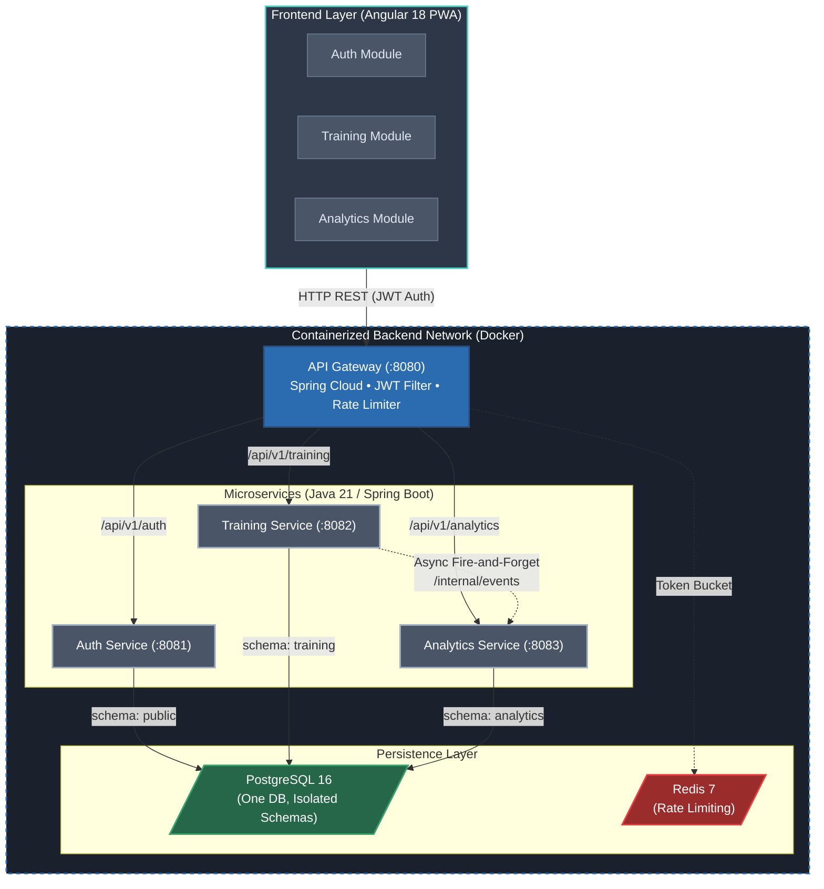

# Training App

A microservices-based personal training tracker. Single-user MVP, multi-user ready from day one.

> **Status**: In development — Session 11 complete (Docker & CI/CD Setup). See [Development Sessions](#development-sessions) for progress.

---

## Table of Contents

1. [Architecture Overview](#1-architecture-overview)
2. [Decisions Log](#2-decisions-log)
3. [Domain Model](#3-domain-model)
4. [Body Parts Reference](#4-body-parts-reference)
5. [Local Development Setup](#5-local-development-setup)
6. [Environment Variables](#6-environment-variables)
7. [API Reference](#7-api-reference)
8. [Analytics Event Flow](#8-analytics-event-flow)
9. [Deployment Guide](#9-deployment-guide)
10. [CI/CD Pipeline](#10-cicd-pipeline)
11. [Security Notes](#11-security-notes)
12. [Adding a New Service](#12-adding-a-new-service)

---

## 1. Architecture Overview

The system is composed of an API Gateway, three domain-specific microservices, and a frontend PWA. The backend services are backed by a single PostgreSQL instance (with isolated schemas) and Redis for rate limiting.

### Containerization & Deployment (CV Highlight)
This project is built from the ground up to be fully containerized and cloud-native.
- **Docker & Docker Compose**: The entire stack (Backend Microservices, Frontend PWA, PostgreSQL, and Redis) runs seamlessly in Docker. `docker-compose.yml` serves as the core orchestrator for local deployments, ensuring environmental parity between dev, testing, and production.
- **Multi-Stage Builds**: Every service and the frontend uses highly optimized multi-stage Dockerfiles. The frontend compiles via Node.js and serves statically via Nginx (Alpine), while Java services build via Maven and run on lightweight JRE containers.
- **CI/CD Pipeline**: Automated GitHub Actions workflows run on every PR to validate tests, compile modules (`mvn verify` and `npm run build`), and enforce code linting. Upon merge to `main`, the CD pipeline automatically builds and pushes the Docker images to a Container Registry for deployment.
- **Kubernetes (K8s) Ready**: The architecture is designed to run on any standard K8s cluster (manifests postponed pending initial verification).



---

## 2. Decisions Log

| Decision | Choice | Rationale |
|----------|--------|-----------|
| Users | Single user MVP, multi-user ready | All entities carry `user_id` from day one. Expansion requires no schema changes. |
| Analytics scope | Pre-calculated metrics only | Weekly volume snapshots + exercise progress entries. No raw event logs. |
| Analytics communication | HTTP fire-and-forget (training → analytics) | Simplest pattern that keeps services decoupled. Swappable for a message broker later. |
| Frontend | Angular PWA (installable, no offline) | Works in Android browser and installable to home screen. No service worker caching. |
| Frontend rendering | Responsive web only | No native app. |
| Auth strategy | JWT (access + refresh). HttpOnly cookie for refresh token | Secure by default. Multi-user expansion requires zero auth rework. |
| Password storage | BCrypt cost 12 | Industry standard. |
| Admin user | Seeded from env vars on startup | No hardcoded credentials in source. |
| ORM | Spring Data JPA + Hibernate | Standard. Flyway manages migrations. Entities never exposed directly from controllers. |
| Database | PostgreSQL 16 | One instance for MVP; each service gets its own schema. |
| Build | Maven multi-module | Shared dependency versions in parent POM. All versions pinned. No floating versions. |
| Charts | ng2-charts | Minimal, functional. |
| Styling | Tailwind CSS utility classes, lightweight UI libraries allowed | Lightweight animations/transitions allowed if they don't impact computational cost. |
| PWA | vite-plugin-pwa + manifest.json | Enables Android installation. No offline caching. |
| Language | English everywhere | Variable names, functions, comments, commits, docs. |

---

## 3. Domain Model

**training-service entities:**
- `Exercise`: Global catalog of exercises.
- `ExerciseBodyPartTarget`: Defines how much an exercise "hits" a specific body part.
- `TrainingProgram`: Top-level container.
- `WeekTemplate`: The repeating week blueprint.
- `DayTemplate`: A training day within the week (no fixed weekday).
- `DayExercise`: Exercise assigned to a DayTemplate.
- `WorkoutSession`: An actual training day performed by the user.
- `WorkoutSet`: One logged set within a session.

**analytics-service entities (derived, read-only):**
- `WeeklyVolumeSnapshot`: Total sets × target_value across all sessions in a week per body part.
- `ExerciseProgressEntry`: Heaviest set logged and total volume per exercise per session.

---

## 4. Body Parts Reference

Fixed Java enum — no table, no CRUD:

```
CHEST, BACK, SHOULDERS, BICEPS, TRICEPS,
QUADS, HAMSTRINGS, GLUTES, CALVES, CORE, FOREARMS, TRAPS
```

---

## 5. Local Development Setup

**Prerequisites:** Docker, Docker Compose

**Quick start:**

```bash
git clone https://github.com/JSR-Mario/training-app.git
cd training-app
cp .env.example .env
# Edit .env — fill in all values before starting
docker-compose up -d
```
The application will be available at `http://localhost:3000` (Frontend) and `http://localhost:8080` (API Gateway).

**Dev mode** (exposes all internal ports, activates `dev` Spring profile for hot reload):

```bash
docker-compose -f docker-compose.yml -f docker-compose.dev.yml up
```

---

## 6. Environment Variables

All secrets and variables are managed via `.env`.

| Variable | Description | Example |
|----------|-------------|---------|
| `POSTGRES_DB` | Master DB name | `trainingapp` |
| `POSTGRES_USER` | DB User | `trainingapp_user` |
| `POSTGRES_PASSWORD` | DB Password | `supersecret123` |
| `REDIS_PASSWORD` | Redis auth pass | `redissecret123` |
| `JWT_SECRET` | 256-bit random hex string | `e0c...` |
| `JWT_ACCESS_EXPIRY_MINUTES` | Access token lifespan | `15` |
| `JWT_REFRESH_EXPIRY_DAYS` | Refresh token lifespan | `7` |
| `ADMIN_USERNAME` | Initial admin user | `admin` |
| `ADMIN_EMAIL` | Initial admin email | `admin@trainingapp.local` |
| `ADMIN_PASSWORD` | Initial admin password | `admin123` |
| `ALLOWED_ORIGIN` | CORS frontend origin | `http://localhost:3000` |
| `API_BASE_URL` | Frontend API target | `http://localhost:8080` |

---

## 7. API Reference

All requests must go through the API Gateway at port `8080`.
Swagger UI is available at: `http://localhost:8080/swagger-ui.html`

- **Auth Service**: `/api/v1/auth/**` (Register, Login, Refresh, Me)
- **Training Service**: `/api/v1/training/**` (Programs, Weeks, Days, Exercises, Sessions)
- **Analytics Service**: `/api/v1/analytics/**` (Volume, Progress)

---

## 8. Analytics Event Flow

When a `WorkoutSession` is marked as completed in training-service:
1. `WorkoutSessionService` calls `AnalyticsNotificationClient` (WebClient, non-blocking).
2. `AnalyticsNotificationClient` sends `POST /internal/events/session-completed` with the full session payload.
3. analytics-service receives the event, calculates metrics, and upserts into its tables.
4. If analytics-service is down, the call fails silently. Session data is safely preserved in training-service and metrics can be recalculated on demand via admin endpoints.

---

## 9. Deployment Guide

Deployment is standard Docker-based deployment.
1. Ensure your server has Docker and Docker Compose installed.
2. Clone the repository and setup the `.env` file with production secrets.
3. Run `docker-compose up -d --build`.
4. Expose port `3000` (Frontend) and `8080` (API Gateway) through your preferred Reverse Proxy or Cloud Load Balancer.

---

## 10. CI/CD Pipeline

The project uses GitHub Actions for Continuous Integration and Continuous Deployment.

**CI (`.github/workflows/ci.yml`)**:
Runs on every push and pull request to `develop` or `main`.
- `backend` job: Uses `maven:3.9-eclipse-temurin-21` to run `mvn verify` across all modules.
- `frontend` job: Uses `node:24` to run `npm ci`, `npm run build`, and `npm run lint`.

**CD (`.github/workflows/cd.yml`)**:
Triggers on merge to `main`.
- `build-and-push` job: Builds all 5 multi-stage Dockerfiles concurrently and pushes them to GitHub Container Registry (`ghcr.io`).
- `deploy` job: Placeholder step for triggering the deployment on Antigravity infrastructure.

---

## 11. Security Notes

1. **Tokens**: JWT access token has a 15-minute expiry. Refresh token is a 7-day HttpOnly, Secure, SameSite=Strict cookie. Never in localStorage.
2. **Passwords**: BCrypt cost factor 12 for all passwords.
3. **Data Isolation**: Every query filters by `userId` extracted from the JWT.
4. **Rate Limiting**: Gateway limits `/api/v1/auth/**` to 20 requests/minute per IP via Redis.
5. **Headers**: Security headers added via Gateway (`Strict-Transport-Security`, `X-Frame-Options: DENY`, `X-Content-Type-Options: nosniff`, `Referrer-Policy: no-referrer`).
6. **Internal Traffic**: The analytics internal endpoint (`/internal/**`) is strictly blocked at the gateway level.

---

## 12. Adding a New Service

1. Create a new module folder under `services/`.
2. Add the module to the parent `pom.xml`.
3. Configure the service to use its own PostgreSQL schema in its `application.yml`.
4. Update `api-gateway` routes and internal filters if it requires external exposure.
5. Create a `Dockerfile` for the new service.
6. Add the service to `docker-compose.yml` and `.github/workflows/cd.yml`.

---

## Development Sessions

| Session | Branch | Focus | Status |
|---------|--------|-------|--------|
| 1 | `feat/session-1-infra-foundation` | Repository & Infrastructure Foundation | ✅ Done |
| 2 | `feat/session-2-auth-service` | Auth Service | ✅ Done |
| 3 | `feat/session-3-training-domain` | Training Service: Domain Entities | ✅ Done |
| 4 | `feat/session-4-workout-logging` | Training Service: Workout Logging | ✅ Done |
| 5 | `feat/session-5-analytics-service` | Analytics Service | ✅ Done |
| 6 | `feat/session-6-api-gateway` | API Gateway | ✅ Done |
| 7 | `feat/session-7-frontend-foundation` | Frontend: Foundation + Auth | ✅ Done |
| 8 | `feat/session-8-frontend-programs` | Frontend: Program & Exercise Management | ✅ Done |
| 9 | `feat/session-9-frontend-workout` | Frontend: Workout Logging | ✅ Done |
| 10 | `feat/session-10-frontend-analytics` | Frontend: Analytics Charts | ✅ Done |
| 11 | `feat/session-11-cicd-deployment` | Dockerfiles, CI/CD & Deployment | ✅ Done |
