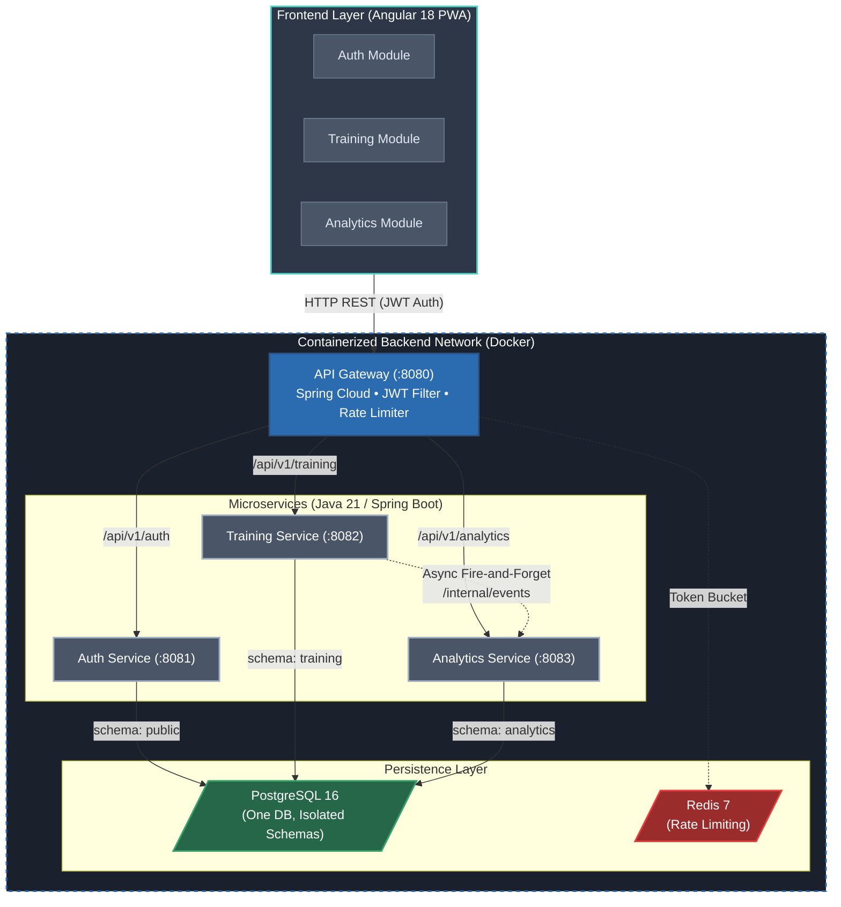

# Training App

A microservices-based personal training tracker. Single-user MVP, multi-user ready from day one.

> **Status**: In development — Session 8 complete. See [Development Sessions](#development-sessions) for progress.

---

## Table of Contents

1. [Architecture Overview](#1-architecture-overview)
2. [Decisions Log](#2-decisions-log)
3. [Domain Model](#3-domain-model)
4. [Body Parts Reference](#4-body-parts-reference)
5. [Local Development Setup](#5-local-development-setup)
6. [Environment Variables](#6-environment-variables)
7. [API Reference](#7-api-reference)
8. [Analytics Event Flow](#8-analytics-event-flow)
9. [Deployment Guide](#9-deployment-guide)
10. [CI/CD Pipeline](#10-cicd-pipeline)
11. [Security Notes](#11-security-notes)
12. [Adding a New Service](#12-adding-a-new-service)

---

## 1. Architecture Overview

The system is composed of an API Gateway and three domain-specific microservices, backed by a single PostgreSQL instance (with isolated schemas) and Redis for rate limiting.



---

## 2. Decisions Log

> _Full table to be completed in Session 11. See `docs/PROJECT_PLAN.md` for the complete log._

| Decision | Choice |
|----------|--------|
| Users | Single-user MVP, multi-user ready (`user_id` on every entity) |
| Auth | JWT access token (15 min) + refresh token in HttpOnly cookie (7 days) |
| Database | PostgreSQL 16 — one instance, one schema per service |
| Build | Maven multi-module — all versions pinned in parent `pom.xml` |
| Frontend | Angular 18 PWA — installable on Android, no offline caching |
| Styling | Tailwind utility classes only — no component libraries |
| Analytics | Pre-calculated metrics only — HTTP fire-and-forget from training-service |

---

## 3. Domain Model

> _Full ERD to be completed in Session 11. See `docs/PROJECT_PLAN.md` for entity definitions._

**training-service entities:** `Exercise`, `ExerciseBodyPartTarget`, `TrainingProgram`,
`WeekTemplate`, `DayTemplate`, `DayExercise`, `WorkoutSession`, `WorkoutSet`

**analytics-service entities (derived, read-only):** `WeeklyVolumeSnapshot`, `ExerciseProgressEntry`

---

## 4. Body Parts Reference

Fixed Java enum — no table, no CRUD:

```
CHEST, BACK, SHOULDERS, BICEPS, TRICEPS,
QUADS, HAMSTRINGS, GLUTES, CALVES, CORE, FOREARMS, TRAPS
```

---

## 5. Local Development Setup

> _Step-by-step guide to be completed in Session 11._

**Prerequisites:** Java 21, Maven 3.9.x, Docker, Docker Compose, Node 20

**Quick start:**

```bash
git clone https://github.com/JSR-Mario/training-app.git
cd training-app
cp .env.example .env
# Edit .env — fill in all values before starting
docker-compose up
```

**Dev mode** (exposes all internal ports, activates `dev` Spring profile):

```bash
docker-compose -f docker-compose.yml -f docker-compose.dev.yml up
```

---

## 6. Environment Variables

> _Full reference table to be completed in Session 11. See [.env.example](.env.example) for all variables and descriptions._

---

## 7. API Reference

> _To be completed in Session 11._

Swagger UI: `http://localhost:8080/swagger-ui.html` (available once full stack is running).

---

## 8. Analytics Event Flow

> _To be completed in Session 11._

---

## 9. Deployment Guide

> _To be completed in Session 11._

---

## 10. CI/CD Pipeline

> _Full documentation to be completed in Session 11._

**CI** (`ci.yml`) runs on every push and pull request to `develop` or `main`:
- `backend` job: `mvn verify` — compiles all modules and runs all tests.
- `frontend` job: `npm ci` + `npm run build` + `npm run lint` — skips automatically until Session 7 adds `frontend/package.json`.

**CD** (`cd.yml`, added in Session 11): triggers on merge to `main` — builds Docker images, pushes to GHCR, deploys to Antigravity.

### Git Workflow

```
main          ← production. Protected. CD triggers here.
develop       ← integration. Protected. All sessions merge here first.
feat/session-N-* ← one branch per session (agent creates these).
fix/*         ← bug fixes branched from develop.
chore/*       ← infra, config, tooling changes.
docs/*        ← documentation-only changes.
```

**Per-session flow:**
1. Agent creates `feat/session-N-*` from `develop`, does the work, pushes.
2. You open a PR: `feat/*` → `develop`.
3. CI must pass before merge.
4. You merge and delete the branch (enabled via repo settings).
5. Repeat for the next session.

**Production release** (Session 11 only):
1. You open a PR: `develop` → `main`.
2. CI passes → you merge → CD deploys automatically.

---

## 11. Security Notes

> _To be completed in Session 11._

---

## 12. Adding a New Service

> _To be completed in Session 11._

---

## Development Sessions

| Session | Branch | Focus | Status |
|---------|--------|-------|--------|
| 1 | `feat/session-1-infra-foundation` | Repository & Infrastructure Foundation | ✅ Done |
| 2 | `feat/session-2-auth-service` | Auth Service | ✅ Done |
| 3 | `feat/session-3-training-domain` | Training Service: Domain Entities | ✅ Done |
| 4 | `feat/session-4-workout-logging` | Training Service: Workout Logging | ✅ Done |
| 5 | `feat/session-5-analytics-service` | Analytics Service | ✅ Done |
| 6 | `feat/session-6-api-gateway` | API Gateway | ✅ Done |
| 7 | `feat/session-7-frontend-foundation` | Frontend: Foundation + Auth | ✅ Done |
| 8 | `feat/session-8-frontend-programs` | Frontend: Program & Exercise Management | ⬜ Pending |
| 9 | `feat/session-9-frontend-workout` | Frontend: Workout Logging | ⬜ Pending |
| 10 | `feat/session-10-frontend-analytics` | Frontend: Analytics Charts | ⬜ Pending |
| 11 | `feat/session-11-cicd-deployment` | Dockerfiles, CI/CD & Deployment | ⬜ Pending |
