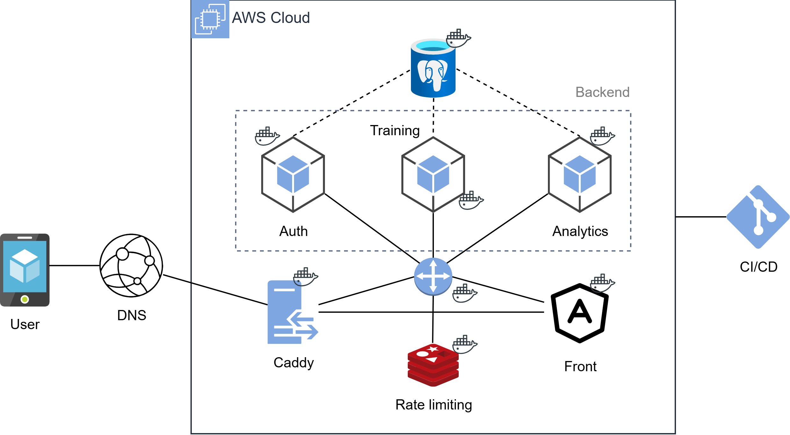

# Yes App - Personal Training Platform

A cloud-native, microservices-based platform for tracking workout sessions, managing exercise programs, and analyzing fitness progress.

## Architecture



> **Note:** The architecture diagram is currently being updated to reflect the latest infrastructure additions (Cloudflare Tunnel ingress, Caddy internal proxy, Redis L2 caching, and the Centralized Observability Stack).

## Tech Stack

- **Backend:** Java 21, Spring Boot 3.3, Spring Cloud Gateway, Spring Security, Hibernate / JPA
- **Frontend:** Angular 21, TypeScript, RxJS, PWA
- **Database & Cache:** PostgreSQL 16 (per-service schemas), Redis (Rate Limiting & L2 Caching), Flyway (Migrations)
- **Observability:** Prometheus, Grafana, Loki, Promtail, Micrometer
- **Infrastructure:** Docker, Docker Compose, GitHub Actions (CI/CD), AWS EC2, Cloudflare Tunnels

## Key Technical Features

- **Microservices Architecture:** Independently scalable services for Authentication, Training, and Analytics.
- **API Gateway Pattern:** Centralized entry point handling stateless JWT validation, CORS, and IP-based rate limiting.
- **Centralized Observability:** Proactive system monitoring with Prometheus (metrics collection), Loki & Promtail (docker container log aggregation), and Grafana dashboards tracking 500 errors, response times (p95), and CPU/RAM memory usage.
- **Event-Driven Metrics:** Asynchronous cross-service communication for volume and progress tracking.
- **Progressive Web App (PWA):** Installable web frontend providing a native-like experience.
- **Automated CI/CD:** Continuous Integration and Deployment pipelines using GitHub Actions for testing and multi-stage container builds.
- **Security First:** Short-lived access tokens, HttpOnly refresh cookies, BCrypt password hashing, and isolated internal networks.

## Local Setup

**Prerequisites:** Docker, Docker Compose

```bash
git clone https://github.com/JSR-Mario/training-app.git
cd training-app
# Ensure you have a populated .env file in the root
docker-compose up -d
```

- **Frontend:** `http://localhost:3000`
- **API Gateway (Swagger UI):** `http://localhost:8080/swagger-ui.html`
- **Grafana Monitoring:**
  - **Local/SSH Tunnel:** `http://localhost:3000` (`ssh -L 3000:127.0.0.1:3000 user@ec2-host`)
  - **Production Access:** Routed via Cloudflare Tunnel (`grafana.yourdomain.com`) and secured behind Cloudflare Zero Trust (Email OTP Access Policy).

## Infrastructure & Security Highlights

- **Authentication:** Stateless JWT design with 15-minute access tokens and 7-day secure refresh cookies.
- **Rate Limiting & Caching:** Gateway limits authentication endpoints via Redis; L2 read-caching accelerates exercise catalog lookups.
- **Observability & Security:** Strict resource-budgeted monitoring (~850MB cap) via Prometheus, Loki, Promtail, and Grafana. Exposed in production exclusively through Cloudflare Tunnel with Zero Trust Access protection.
- **Automated Backups:** Host-level cron scripts push daily database snapshots to AWS S3.
- **Deployment:** Hosted on AWS EC2 behind Cloudflare Tunnels to securely expose the application without opening public server ports.


