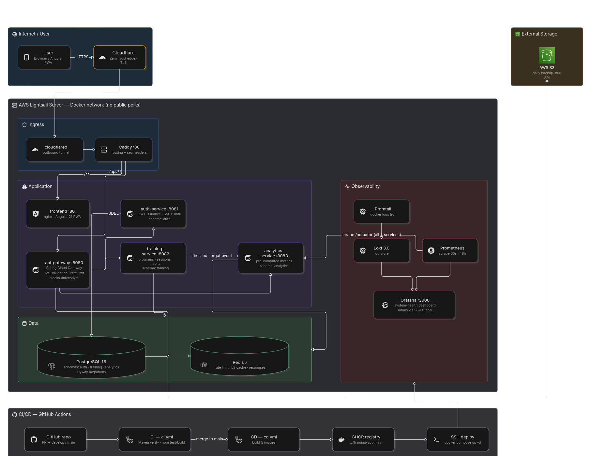

# Yes App - Personal Training Platform

A cloud-native, microservices-based platform for tracking workout sessions, managing exercise programs, and analyzing fitness progress.

## Architecture



> **Note:** The architecture diagram is currently being updated to reflect the latest infrastructure additions (Cloudflare Tunnel ingress, Caddy internal proxy, Redis L2 caching, and the Centralized Observability Stack).

## Tech Stack

- **Backend:** Java 21, Spring Boot 3.3, Spring Cloud Gateway, Spring Security, Hibernate / JPA
- **Frontend:** Angular 21, TypeScript, RxJS, PWA
- **Database & Cache:** PostgreSQL 16 (per-service schemas), Redis (Rate Limiting & L2 Caching), Flyway (Migrations)
- **Observability:** Prometheus, Grafana, Loki, Promtail, Micrometer
- **Infrastructure:** Docker, Docker Compose, GitHub Actions (CI/CD), AWS EC2, Cloudflare Tunnels

## Key Technical Features

- **Microservices Architecture:** Independently scalable services for Authentication, Training, and Analytics.
- **API Gateway Pattern:** Centralized entry point handling stateless JWT validation, CORS, and IP-based rate limiting.
- **Centralized Observability:** Proactive system monitoring with Prometheus (metrics collection), Loki & Promtail (docker container log aggregation), and Grafana dashboards tracking 500 errors, response times (p95), and CPU/RAM memory usage.
- **Event-Driven Metrics:** Asynchronous cross-service communication for volume and progress tracking.
- **Progressive Web App (PWA):** Installable web frontend providing a native-like experience.
- **Automated CI/CD:** Continuous Integration and Deployment pipelines using GitHub Actions for testing and multi-stage container builds.
- **Security First:** Short-lived access tokens, HttpOnly refresh cookies, BCrypt password hashing, and isolated internal networks.

## Local Setup

**Prerequisites:** Docker, Docker Compose

```bash
git clone https://github.com/JSR-Mario/training-app.git
cd training-app
# Ensure you have a populated .env file in the root
docker-compose up -d
```

- **Frontend (Production):** `https://app.jsr-mario.com` (Local dev: `http://localhost:3000`)
- **API Gateway (Swagger UI):** `http://localhost:8080/swagger-ui.html`
- **Grafana Monitoring:**
  - **Production Access:** `https://grafana.jsr-mario.com` (Secured behind Cloudflare Zero Trust Email OTP Policy).
  - **Local / SSH Tunnel:** `http://localhost:3000` (`ssh -L 3000:127.0.0.1:3000 user@ec2-host`).

## Infrastructure & Security Highlights

- **Authentication:** Stateless JWT design with 15-minute access tokens and 7-day secure refresh cookies.
- **Rate Limiting & Caching:** Gateway limits authentication endpoints via Redis; L2 read-caching accelerates exercise catalog lookups.
- **Observability & Security:** Strict resource-budgeted monitoring (~850MB cap) via Prometheus, Loki, Promtail, and Grafana. Exposed in production exclusively through Cloudflare Tunnel with Zero Trust Access protection.
- **Automated Backups:** Host-level cron scripts push daily database snapshots to AWS S3.
- **Deployment:** Hosted on AWS EC2 / Lightsail behind Cloudflare Tunnels to securely expose the application without opening public server ports.

## Environment Variables

Copy `.env.example` to `.env` in the project root directory before running the application. **Never commit `.env` to version control.**

Key configurations:
- **`POSTGRES_*`**: Database credentials and connection parameters (`POSTGRES_HOST`, `POSTGRES_PORT`, `POSTGRES_DB`, `POSTGRES_USER`, `POSTGRES_PASSWORD`).
- **`REDIS_*`**: Cache and rate-limiting connection parameters (`REDIS_HOST`, `REDIS_PORT`, `REDIS_PASSWORD`).
- **`JWT_SECRET`**: 256-bit random hex string for signing JWT tokens (`openssl rand -hex 32`).
- **`JWT_ACCESS_EXPIRY_MINUTES` / `JWT_REFRESH_EXPIRY_DAYS`**: Token lifetime configuration.
- **`ADMIN_*`**: Initial administrative account parameters (`ADMIN_USERNAME`, `ADMIN_EMAIL`, `ADMIN_PASSWORD`).
- **`ALLOWED_ORIGIN` & `DOMAIN_NAME`**: Public domain configuration for CORS and proxy rules.
- **`S3_BUCKET`**: Target AWS S3 bucket URI for automated database snapshots 
- **`CLOUDFLARE_TUNNEL_TOKEN`**: Tunnel authentication token for secure ingress.
- **`GRAFANA_PASSWORD`**: Admin password for Grafana UI. Defaults to `admin` if not provided.

## Hosting on a New Server

To deploy the application on a fresh Linux instance (e.g., AWS Lightsail, EC2), follow these steps:

### 1. Initial Server Dependencies
- **Install Docker (Official):** Avoid older OS repositories. The official script installs Docker and the latest `docker-compose-plugin`.
  ```bash
  curl -fsSL https://get.docker.com -o get-docker.sh && sudo sh get-docker.sh
  sudo usermod -aG docker $USER
  newgrp docker
  ```
- **Install AWS CLI v2:** (Required if using S3 backups).
  ```bash
  sudo apt update && sudo apt install -y unzip curl
  curl "https://awscli.amazonaws.com/awscli-exe-linux-x86_64.zip" -o "awscliv2.zip"
  unzip awscliv2.zip && sudo ./aws/install && rm -rf aws awscliv2.zip
  ```
- **Allocate 4GB Swap Space:** Protect against out-of-memory errors.
  ```bash
  sudo fallocate -l 4G /swapfile
  sudo chmod 600 /swapfile
  sudo mkswap /swapfile
  sudo swapon /swapfile
  echo '/swapfile none swap sw 0 0' | sudo tee -a /etc/fstab
  sudo sysctl vm.swappiness=10
  echo 'vm.swappiness=10' | sudo tee -a /etc/sysctl.conf
  ```

### 2. Application Setup & CI/CD Reminders
1. Clone the repository and navigate to the project root.
2. Create your `.env` file based on `.env.example` and fill in all production variables.
3. Configure AWS credentials via `aws configure` to grant S3 access.
4. **CI/CD Reminder:** If you are migrating servers, remember to update the corresponding secrets in your GitHub repository settings (e.g., `CLOUDFLARE_TUNNEL_TOKEN`, SSH Keys, Server IPs) so that your GitHub Actions pipelines deploy to the new environment successfully.

### 3. Database Initialization (Fresh vs Restore)

**Option A: Start Fresh**
If you are starting completely from scratch:
```bash
docker compose up -d
```
*Flyway will automatically create all required schemas and tables on startup.*

**Option B: Restore from an S3 Backup**
If you have an existing backup, **do not** start the full application yet. If you already ran `docker compose up -d`, you must wipe the database volumes first (`docker compose down -v`) to prevent Flyway from creating conflicting schemas.

1. Start ONLY the database container:
   ```bash
   docker compose up -d postgres
   ```
2. Wait a few seconds for Postgres to initialize, then restore the dump:
   ```bash
   # Use the specific backup date (YYYY-MM-DD)
   ./scripts/restore-from-s3.sh 2026-07-25
   ```
3. Once the restore completes without `already exists` errors, launch the full stack:
   ```bash
   docker compose up -d
   ```

### 4. Database Backups
To trigger a manual database snapshot to your configured `S3_BUCKET`:
```bash
./scripts/backup-s3.sh
```


