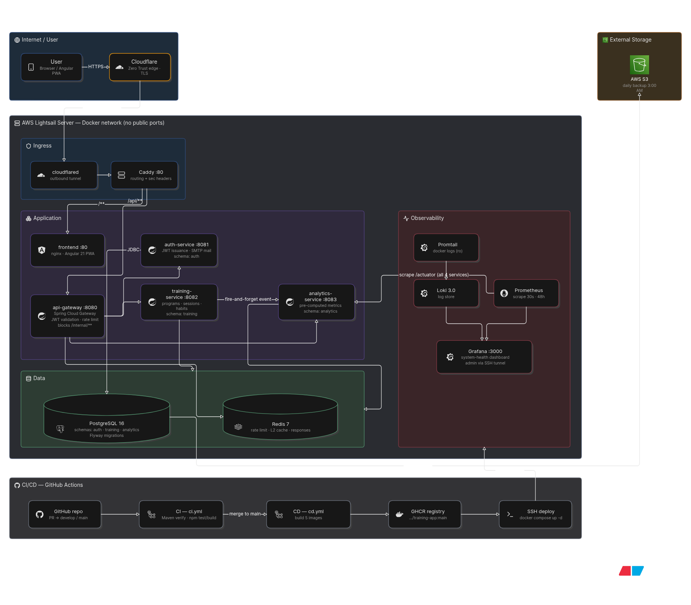

# Yes App - Personal Training Platform

I built Yes App to track my own workouts, manage fitness programs, and analyze long-term progress without relying on third-party subscriptions. It is a personal project architected as a set of backend microservices with an Angular PWA on top, designed from the ground up to be scalable, secure, and easy to iterate on locally.

## Architecture

[](https://htmlpreview.github.io/?https://github.com/JSR-Mario/training-app/blob/main/docs/architecture.html)

*Click the diagram above for the [Interactive Architecture Viewer (Live Web Preview)](https://htmlpreview.github.io/?https://github.com/JSR-Mario/training-app/blob/main/docs/architecture.html) or open [`docs/architecture.html`](docs/architecture.html) in a local browser (supports route tracing, node focusing, and guided tours).*

### Architectural Highlights

1. **Edge & Ingress (Zero Trust)**
   - **Cloudflare Tunnel**: Routes incoming HTTPS traffic into Caddy with zero open public ports.
   - **Caddy Proxy**: Internal reverse proxy routing static PWA requests to Nginx and `/api/**` to API Gateway.

2. **Microservices Core & Data**
   - **API Gateway (:8080)**: Stateless JWT verification, Redis rate-limiting (20 req/min), and CORS.
   - **Auth Service (:8081)**: BCrypt 12, JWT issuance, HttpOnly refresh cookies, and email verification.
   - **Training Service (:8082)**: Core domain logic (Programs, Workouts, Exercises).
   - **Analytics Service (:8083)**: Pre-calculated volume and progress metrics fed via asynchronous fire-and-forget events.
   - **PostgreSQL 16**: Multi-schema isolation (`auth`, `training`, `analytics`) with Flyway migrations.
   - **Redis 7**: Cache and API Gateway rate-limiting storage.

3. **Observability Stack (PLG)**
   - **Prometheus (:9090)**: Continuous 30s scraping of Spring Boot `/actuator/prometheus` metrics.
   - **Promtail**: Docker log scraper attached directly to `docker.sock`.
   - **Grafana Loki (:3100)**: Low-footprint indexed log stream storage.
   - **Grafana (:3000)**: Unified dashboards visualizing system health, p95 latencies, and logs.

4. **AWS Cloud & DevOps**
   - **AWS Lightsail Linux VM**: Docker Compose production host.
   - **AWS S3**: Daily automated 3:00 AM cron backups (`backup-s3.sh`) storing encrypted PostgreSQL dumps.
   - **AWS SES / SMTP**: Transactional emails for account verification links.
   - **GitHub Actions & GHCR**: Automated CI testing on PRs and CD multi-stage image deployment.


## Tech Stack

**Backend**
- **Java 21 & Spring Boot 3.3:** Core microservices framework taking advantage of modern Java features.
- **Spring Cloud Gateway:** Centralized entry point, rate limiting, and stateless JWT validation.
- **Spring Security & Hibernate / JPA:** Robust authentication and ORM.

**Frontend**
- **Angular 21:** Standalone components and modern Angular features.
- **TypeScript & RxJS:** Reactive programming for state and data streams.
- **PWA (Progressive Web App):** Installable, native-like user experience.

**Database, Cache & Observability**
- **PostgreSQL 16:** Relational data storage with per-service isolated schemas.
- **Redis 7:** Rate limiting and L2 query caching.
- **Flyway:** Automated, version-controlled database migrations.
- **Prometheus, Grafana, Loki & Promtail:** Centralized observability, log aggregation, and metrics.

**Infrastructure & DevOps**
- **Docker & Docker Compose:** Containerized environments for consistent development and production.
- **GitHub Actions (CI/CD):** Automated testing and multi-stage container builds.
- **AWS Lightsail & Cloudflare Tunnels:** Secure deployment without exposed public ports.

## Key Technical Highlights

- The application is split into independently scalable microservices (Authentication, Training, Analytics) rather than a monolith.
- All external traffic flows through a single Spring Cloud API Gateway, which handles JWT validation statelessly and enforces IP-based rate limiting via Redis.
- Cross-service communication relies on asynchronous fire-and-forget events; for instance, the training service notifies the analytics engine of a completed workout without blocking the user's flow.
- Security is strictly enforced via short-lived access tokens (15m), HttpOnly refresh cookies (7d), and BCrypt password hashing, utilizing environment variables to avoid any hardcoded credentials.
- Automated GitHub Actions pipelines ensure every pull request passes unit tests before building and deploying multi-stage, optimized Docker containers.
- To keep infrastructure costs low, system monitoring collects logs and critical metrics (like p95 response times) efficiently within a strict memory footprint using Prometheus and Loki.
- Custom bash scripts orchestrate a hybrid local development environment, blending Dockerized databases with native JVM/Node execution to enable fast iteration and rapid hot-reloads.

## Local Development Setup

To provide the best developer experience, we use a **Hybrid Approach** for local development. Running 12+ containers locally consumes significant resources and slows down iteration. Instead, we run Postgres and Redis in Docker, while the microservices and Angular frontend run natively for immediate feedback.

**Prerequisites:** Docker, NodeJS 24+, Java 21+, Maven

1. **Clone the repository:**
   ```bash
   git clone https://github.com/JSR-Mario/training-app.git
   cd training-app
   ```

2. **Configure Environment:**
   Copy `.env.example` to `.env.local` and populate the required development credentials. Ensure `JWT_SECRET` is a valid 64-character hexadecimal string.

3. **Start the Environment:**
   ```bash
   ./scripts/start-local.sh
   ```
   *This launches Postgres/Redis via Docker, waits for initialization, and boots all 4 Spring Boot services and the Angular frontend simultaneously with color-coded logs.*
   *Note: For testing data, create your own test account locally or use the built-in admin seed.*

4. **Access the App:**
   - **Frontend (Hot-Reload):** `http://localhost:4200`
   - **API Gateway (Swagger UI):** `http://localhost:8080/swagger-ui.html`

5. **Stop the Environment:**
   Press `Ctrl+C` in the terminal to gracefully shut down the JVM/Node processes and automatically stop the Docker containers. If processes become orphaned, run `./scripts/stop-local.sh` to forcefully clean up the ports.

## Production Replica (Full Docker)

To test the exact infrastructure that runs on the production server (including Prometheus, Grafana, and internal routing), use the full compose file. Ensure you have a populated `.env` file in the root.

```bash
docker compose up -d
```
- **Frontend (Production Bundle):** Accessible via your configured `DOMAIN_NAME` (routed through Cloudflare Tunnel).
- **Grafana Monitoring:** `http://localhost:3000` (accessible locally or via SSH Tunnel if deployed remotely).

## Hosting on a New Server

When setting up a fresh Linux instance (e.g., AWS Lightsail, EC2), here is everything needed to get the stack running.

### 1. Initial Server Dependencies

**Install Docker (Official):** Avoid older OS repositories -- the official script installs Docker and the latest `docker-compose-plugin`.
```bash
curl -fsSL https://get.docker.com -o get-docker.sh && sudo sh get-docker.sh
sudo usermod -aG docker $USER
newgrp docker
```

**Install AWS CLI v2** (required if using S3 backups):
```bash
sudo apt update && sudo apt install -y unzip curl
curl "https://awscli.amazonaws.com/awscli-exe-linux-x86_64.zip" -o "awscliv2.zip"
unzip awscliv2.zip && sudo ./aws/install && rm -rf aws awscliv2.zip
```

**Allocate 4 GB Swap Space** to protect against OOM errors on small instances:
```bash
sudo fallocate -l 4G /swapfile
sudo chmod 600 /swapfile
sudo mkswap /swapfile
sudo swapon /swapfile
echo '/swapfile none swap sw 0 0' | sudo tee -a /etc/fstab
sudo sysctl vm.swappiness=10
echo 'vm.swappiness=10' | sudo tee -a /etc/sysctl.conf
```

### 2. Application Setup & CI/CD Reminders

1. Clone the repository and navigate to the project root.
2. Create your `.env` file from `.env.example` and fill in all production values.
3. Run `aws configure` to grant S3 access to the backup scripts.
4. **If migrating from another server:** update the corresponding secrets in your GitHub repository settings (`CLOUDFLARE_TUNNEL_TOKEN`, SSH keys, server IPs) so that your GitHub Actions pipelines target the new environment correctly.

### 3. Database Initialization (Fresh vs Restore)

**Option A: Start Fresh**

If you are starting from scratch:
```bash
docker compose up -d
```
*Flyway will automatically create all required schemas and tables on first startup.*

**Option B: Restore from an S3 Backup**

If you have an existing backup, do **not** start the full stack yet. If you already ran `docker compose up -d`, wipe the database volumes first (`docker compose down -v`) to prevent Flyway from creating conflicting schemas.

1. Start only the database container:
   ```bash
   docker compose up -d postgres
   ```
2. Wait a few seconds for Postgres to initialize, then restore the dump:
   ```bash
   # Use the specific backup date (YYYY-MM-DD)
   ./scripts/restore-from-s3.sh 2026-07-25
   ```
3. Once the restore completes without `already exists` errors, bring up the full stack:
   ```bash
   docker compose up -d
   ```

### 4. Database Backups

**Manual backup** -- push a snapshot to your configured `S3_BUCKET` on demand:
```bash
./scripts/backup-s3.sh
```

**Automated backups via cron** -- run a snapshot every day at 3:00 AM:

1. Open the crontab editor:
   ```bash
   crontab -e
   ```
2. Add the following line (replace `/path/to/training-app` with your actual project path):
   ```cron
   # Run AWS S3 Database Backup every day at 03:00 AM
   0 3 * * * cd /path/to/training-app && ./scripts/backup-s3.sh >> /path/to/training-app/db-backup.log 2>&1
   ```
   *Ensure the AWS CLI is configured with the correct permissions for the user running the cron job.*

## Environment Variables

The application relies strictly on environment variables for all secrets and configuration. Copy `.env.example` to `.env` in the project root -- **never commit `.env` to version control.**

### Variable Reference

- **`POSTGRES_HOST` / `POSTGRES_PORT` / `POSTGRES_DB` / `POSTGRES_USER` / `POSTGRES_PASSWORD`**: Database connection details.
- **`REDIS_HOST` / `REDIS_PORT` / `REDIS_PASSWORD`**: Cache and rate-limiting connection parameters.
- **`JWT_SECRET`**: 256-bit random hex string for signing JWT tokens (`openssl rand -hex 32`).
- **`JWT_ACCESS_EXPIRY_MINUTES` / `JWT_REFRESH_EXPIRY_DAYS`**: Token lifetime configuration.
- **`ADMIN_USERNAME` / `ADMIN_EMAIL` / `ADMIN_PASSWORD`**: Initial admin account seeded idempotently on startup.
- **`ALLOWED_ORIGIN`**: Strict CORS origin enforced at the Gateway.
- **`DOMAIN_NAME`**: Public domain used for Cloudflare routing and proxy rules.
- **`CLOUDFLARE_TUNNEL_TOKEN`**: Tunnel authentication token for secure ingress.
- **`COOKIE_SECURE`**: Set to `true` in production to enforce `Secure` on refresh token cookies.
- **`AUTH_SERVICE_URL` / `TRAINING_SERVICE_URL` / `ANALYTICS_SERVICE_URL`**: Internal service base URLs used by the Gateway for routing.
- **`S3_BUCKET`**: Target AWS S3 bucket URI for automated database snapshots.
- **`SPRING_MAIL_HOST` / `SPRING_MAIL_PORT` / `SPRING_MAIL_USERNAME` / `SPRING_MAIL_PASSWORD`**: SMTP credentials for outgoing email (e.g., verification links).
- **`APP_FRONTEND_URL`**: Public-facing web URL included in email verification links.
- **`GRAFANA_PASSWORD`**: Admin password for the Grafana UI. Defaults to `admin` if not set.

### Example `.env`

The block below shows the expected shape of each variable. **All values here are fake** -- replace every entry with your actual credentials before running the application.

```env
# ─── Database ─────────────────────────────────────────────
POSTGRES_HOST=postgres
POSTGRES_PORT=5432
POSTGRES_DB=training_db
POSTGRES_USER=training_user
POSTGRES_PASSWORD=changeme_secure_pw

# ─── Redis ────────────────────────────────────────────────
REDIS_HOST=redis
REDIS_PORT=6379
REDIS_PASSWORD=changeme_redis_pw

# ─── Auth / JWT ───────────────────────────────────────────
JWT_SECRET=<64-char-hex-generated-with-openssl-rand-hex-32>
JWT_ACCESS_EXPIRY_MINUTES=15
JWT_REFRESH_EXPIRY_DAYS=7
COOKIE_SECURE=true

# ─── Admin seed ───────────────────────────────────────────
ADMIN_USERNAME=admin
ADMIN_EMAIL=admin@yourdomain.example.com
ADMIN_PASSWORD=changeme_admin_pw

# ─── CORS & Domain ────────────────────────────────────────
ALLOWED_ORIGIN=https://yourdomain.example.com
DOMAIN_NAME=yourdomain.example.com

# ─── Internal service routing ─────────────────────────────
AUTH_SERVICE_URL=http://auth-service:8081
TRAINING_SERVICE_URL=http://training-service:8082
ANALYTICS_SERVICE_URL=http://analytics-service:8083

# ─── Cloudflare ───────────────────────────────────────────
CLOUDFLARE_TUNNEL_TOKEN=<from-cloudflare-zero-trust-dashboard>

# ─── AWS S3 Backups ───────────────────────────────────────
S3_BUCKET=s3://your-bucket-name/backups

# ─── Email (SMTP) ─────────────────────────────────────────
SPRING_MAIL_HOST=smtp.example.com
SPRING_MAIL_PORT=587
SPRING_MAIL_USERNAME=noreply@yourdomain.example.com
SPRING_MAIL_PASSWORD=changeme_smtp_pw
APP_FRONTEND_URL=https://yourdomain.example.com

# ─── Observability ────────────────────────────────────────
GRAFANA_PASSWORD=changeme_grafana_pw
```

## Deployment & Infrastructure

The production environment is hosted on an AWS Lightsail instance, secured entirely behind Cloudflare Tunnels (Zero Trust Access). No application ports are exposed to the public internet.

**Automated Backups:**
Host-level cron scripts (`scripts/backup-s3.sh`) push daily Postgres database snapshots to an encrypted AWS S3 bucket. A companion script (`scripts/restore-from-s3.sh`) is provided for disaster recovery and seamless migration across instances.
