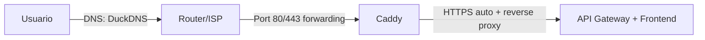
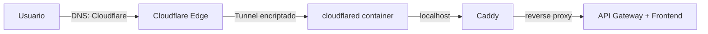

# Migración a Cloudflare Tunnel + Dominio Real

## Contexto

La app `workouthub.duckdns.org` sufre errores **504 Gateway Timeout** en redes públicas porque muchas redes bloquean dominios DuckDNS. La solución es migrar a un **dominio real** con **Cloudflare Tunnel**, eliminando la dependencia de DuckDNS y la necesidad de exponer puertos.

---

## Estimado de Costos Anuales

| Concepto | Costo | Notas |
|----------|-------|-------|
| **Cloudflare Tunnel** | **$0/año** | Incluido en el free tier de Zero Trust (hasta 50 usuarios) |
| **Cloudflare DNS/CDN/SSL** | **$0/año** | Free plan — bandwidth ilimitado, SSL automático, DDoS protection |
| **Dominio `.xyz`** (Cloudflare Registrar) | **~$10-13/año** | Cloudflare cobra a precio de costo (sin markup). Primer año puede ser ~$1 en otros registrars, pero la renovación sube a $10-13 |
| **Dominio `.site`** (alternativa) | **~$10-12/año** | Similar rango |
| **Dominio `.com`** (si prefieres) | **~$10-11/año** | Cloudflare Registrar precio de costo |
| **DuckDNS** | **$0** (se elimina) | Ya no se necesita |
| | | |
| **Total anual estimado** | **~$10-13/año** | Solo el costo del dominio |

> [!TIP]
> **Recomendación de registrar**: Comprar el dominio directamente en **Cloudflare Registrar** — cobra precio de costo sin markup y la renovación es al mismo precio. Esto simplifica todo porque DNS + Tunnel + dominio están en el mismo dashboard.

---

## Limitaciones del Free Tier de Cloudflare

### ✅ Lo que INCLUYE (gratis)

| Feature | Límite |
|---------|--------|
| Cloudflare Tunnel | Hasta 1,000 tunnels por cuenta |
| Réplicas por tunnel | Hasta 25 `cloudflared` replicas |
| Bandwidth CDN | **Ilimitado** (sin caps) |
| Requests por segundo | **Sin límite general** |
| SSL/TLS automático | ✅ Incluido |
| DDoS Protection | ✅ Incluido (nivel básico) |
| Zero Trust Users | Hasta **50 usuarios** |
| DNS queries | Ilimitadas |

### ⚠️ Limitaciones a tener en cuenta

| Limitación | Detalle | ¿Nos afecta? |
|------------|---------|---------------|
| **Contenido no-HTML pesado** | No se debe usar como CDN de video/archivos grandes. Solo HTML, CSS, JS, imágenes | ❌ No — nuestra app es una PWA Angular estándar |
| **Upload máximo por request** | **100 MB** en Free plan | ❌ No — no subimos archivos grandes |
| **Workers** (si los usaras) | 100,000 requests/día, 10ms CPU/request | ❌ No usamos Workers |
| **Cache purge** | 5 requests/minuto via API | ❌ No relevante |
| **Sin SLA garantizado** | El free plan no tiene SLA de uptime | ⚠️ Aceptable para proyecto personal |
| **Latencia adicional** | El tunnel agrega ~5-20ms de latencia (tráfico pasa por Cloudflare antes de llegar a tu server) | ⚠️ Negligible para nuestra app |
| **No HTTP/2 push** | Free plan no soporta server push | ❌ No lo usamos |
| **IP real del usuario** | Cloudflare termina TLS, la IP real viene en header `CF-Connecting-IP` | ⚠️ Hay que ajustar el rate limiter si usa IP |

> [!IMPORTANT]
> La limitación más relevante es la **latencia adicional** (~5-20ms), pero para una app de training personal esto es completamente insignificante.

---

## Arquitectura: Antes vs Después

### Antes (actual)


**Problemas**: DuckDNS bloqueado en redes, puertos 80/443 expuestos en router, IP real visible.

### Después (con Cloudflare Tunnel)


**Beneficios**: Ningún puerto expuesto, IP oculta, funciona en cualquier red, DDoS protection gratis.

---

## Cambios Técnicos Detallados

### Paso 1: Comprar dominio y configurar Cloudflare (manual, ~15 min)

1. Crear cuenta en [Cloudflare](https://dash.cloudflare.com/sign-up)
2. Comprar dominio en Cloudflare Registrar (ej: `workouthub.xyz`)
3. En el dashboard de Cloudflare:
   - Ir a **Zero Trust** → **Networks** → **Tunnels**
   - Crear un tunnel nuevo llamado `training-app`
   - Copiar el **tunnel token** que te genera
   - Configurar la ruta pública:
     - **Domain**: `workouthub.xyz` (o el dominio que compres)
     - **Service**: `http://caddy:80`

---

### Paso 2: Modificar infraestructura

#### [MODIFY] [docker-compose.yml](file:///c:/Users/MarioSosa/Documents/Otros/TR/docker-compose.yml)

Cambios:
1. **Agregar** el servicio `cloudflared`
2. **Eliminar** la publicación de puertos `80:80`, `443:443` del servicio `caddy` (ya no se necesitan)
3. **Agregar** variable `CLOUDFLARE_TUNNEL_TOKEN` al `.env`

```yaml
  # -----------------------------------------------------------
  # Cloudflare Tunnel — Secure ingress, no exposed ports
  # -----------------------------------------------------------
  cloudflared:
    image: cloudflare/cloudflared:latest
    restart: unless-stopped
    command: tunnel --no-autoupdate run
    environment:
      TUNNEL_TOKEN: ${CLOUDFLARE_TUNNEL_TOKEN}
    depends_on:
      - caddy
```

Y en el servicio `caddy`, eliminar los ports:
```diff
  caddy:
    image: caddy:2-alpine
    restart: unless-stopped
-   ports:
-     - "80:80"
-     - "443:443"
-     - "443:443/udp"
    environment:
      DOMAIN_NAME: ${DOMAIN_NAME}
    volumes:
      - ./Caddyfile:/etc/caddy/Caddyfile
      - caddy_data:/data
      - caddy_config:/config
    depends_on:
      - frontend
      - api-gateway
```

#### [MODIFY] [Caddyfile](file:///c:/Users/MarioSosa/Documents/Otros/TR/Caddyfile)

Cloudflare termina TLS externamente. Caddy ahora solo necesita servir HTTP internamente:

```diff
-{$DOMAIN_NAME} {
-    # Security Headers
-    header {
-        Strict-Transport-Security "max-age=31536000; includeSubDomains; preload"
-        X-Frame-Options DENY
-        X-Content-Type-Options nosniff
-        Referrer-Policy no-referrer
-    }
+:80 {
+    # Security Headers (HSTS lo maneja Cloudflare)
+    header {
+        X-Frame-Options DENY
+        X-Content-Type-Options nosniff
+        Referrer-Policy no-referrer
+    }
```

> [!NOTE]
> Se elimina HSTS del Caddyfile porque Cloudflare lo maneja automáticamente. Se cambia el bloque de `{$DOMAIN_NAME}` a `:80` porque Caddy ya no necesita obtener certificados TLS — Cloudflare termina TLS en su edge.

#### [MODIFY] `.env` del servidor

```diff
+# Cloudflare Tunnel
+CLOUDFLARE_TUNNEL_TOKEN=eyJh...your_token_here

 # Caddy / Domain
-DOMAIN_NAME=workouthub.duckdns.org
+DOMAIN_NAME=workouthub.xyz

 # CORS
-ALLOWED_ORIGIN=https://workouthub.duckdns.org
+ALLOWED_ORIGIN=https://workouthub.xyz
```

#### [MODIFY] [.env.example](file:///c:/Users/MarioSosa/Documents/Otros/TR/.env.example)

Agregar la nueva variable y actualizar documentación.

---

### Paso 3: Rate Limiter — IP real del usuario

> [!WARNING]
> Con Cloudflare Tunnel, la IP que ve tu API Gateway será la del contenedor `cloudflared`, no la del usuario real. El header `CF-Connecting-IP` contiene la IP real.

Necesitamos verificar si el `ipKeyResolver` del API Gateway necesita ajuste:

#### [MODIFY] `IpKeyResolver.java` (si existe en api-gateway)

Cambiar para leer `CF-Connecting-IP` header primero, con fallback a la IP directa.

---

### Paso 4: Despliegue

1. Detener los contenedores actuales
2. Cerrar puertos 80/443 en el router (ya no se necesitan)
3. Actualizar `.env` con el nuevo dominio y tunnel token
4. `docker-compose up -d`
5. Verificar que el tunnel está conectado en el dashboard de Cloudflare

---

## Verificación

| Test | Método |
|------|--------|
| Tunnel conectado | Dashboard Cloudflare → Zero Trust → Tunnels → Status: "Healthy" |
| HTTPS funciona | Abrir `https://workouthub.xyz` en el navegador |
| API funciona | Login desde la app |
| PWA funciona | Verificar manifest e íconos cargan |
| Funciona en red pública | Probar desde la red donde fallaba |
| Rate limiter correcto | Verificar logs que la IP real se detecta |

---

## GitHub Issue

> [!IMPORTANT]
> Aquí abajo está el issue listo para copiar y crear en GitHub.

---

````markdown
## 🔧 Migrate from DuckDNS to Cloudflare Tunnel with custom domain

### Problem

The application at `workouthub.duckdns.org` returns **504 Gateway Timeout** errors when accessed from certain public/corporate networks. This happens because many networks block DuckDNS (and similar DDNS services) at the DNS or firewall level, as these domains are commonly associated with malware.

**All requests fail** — both API calls (`/api/v1/auth/refresh`, `/api/v1/auth/logout`) and static assets (`icon-144x144.png`), confirming this is a network-level DNS/connectivity block, not a code issue.

### Current Architecture
- **DNS**: DuckDNS dynamic DNS → points to home/server IP
- **TLS**: Caddy auto-HTTPS (Let's Encrypt)
- **Ingress**: Ports 80/443 forwarded on router
- **Reverse Proxy**: Caddy → API Gateway / Frontend

### Proposed Solution

Replace DuckDNS + port forwarding with **Cloudflare Tunnel** and a **custom domain**.

**New architecture:**
```
User → Cloudflare Edge (TLS termination) → cloudflared tunnel → Caddy (:80) → Services
```

### Benefits
- ✅ Works on all networks (custom domain, not DDNS)
- ✅ No ports exposed on router (zero attack surface)
- ✅ Server IP hidden behind Cloudflare
- ✅ Free DDoS protection
- ✅ Free SSL/TLS management
- ✅ Free CDN for static assets

### Tasks

- [ ] Purchase custom domain via Cloudflare Registrar
- [ ] Create Cloudflare Tunnel in Zero Trust dashboard
- [ ] Add `cloudflared` service to `docker-compose.yml`
- [ ] Update `Caddyfile` — switch from HTTPS domain block to `:80` HTTP block
- [ ] Remove port publishing from `caddy` service in `docker-compose.yml`
- [ ] Update `.env`: `DOMAIN_NAME`, `ALLOWED_ORIGIN`, add `CLOUDFLARE_TUNNEL_TOKEN`
- [ ] Update `.env.example` with new variables and documentation
- [ ] Verify/update `IpKeyResolver` to read `CF-Connecting-IP` header for rate limiting
- [ ] Close ports 80/443 on router
- [ ] Deploy and verify from multiple networks
- [ ] Update `README.md` with new setup instructions

### Estimated Cost
| Item | Annual Cost |
|------|-------------|
| Cloudflare Tunnel | $0 (free tier) |
| Cloudflare DNS/CDN/SSL | $0 (free plan) |
| Custom domain (`.xyz` or `.com`) | ~$10-13/year |
| **Total** | **~$10-13/year** |

### Estimated Effort
**~1-2 hours** (including domain purchase, Cloudflare setup, and deployment)

### Labels
`infrastructure`, `networking`, `bug-fix`, `enhancement`

### Priority
**High** — Blocks users on public/corporate networks from accessing the app.
````

---

## Open Questions

1. **¿Qué dominio prefieres?** Ej: `workouthub.xyz`, `workouthub.site`, `workouthub-app.com`, etc. Esto afecta el precio (`.xyz` ≈ $10/año, `.com` ≈ $10-11/año en Cloudflare).
2. **¿Quieres que implemente los cambios de código ahora** (docker-compose, Caddyfile, .env.example, IpKeyResolver) o prefieres hacerlo después de comprar el dominio y crear el tunnel?
3. **¿Tu API Gateway tiene un `IpKeyResolver` personalizado?** Necesito verificar si necesita adaptarse para leer el header `CF-Connecting-IP`.
